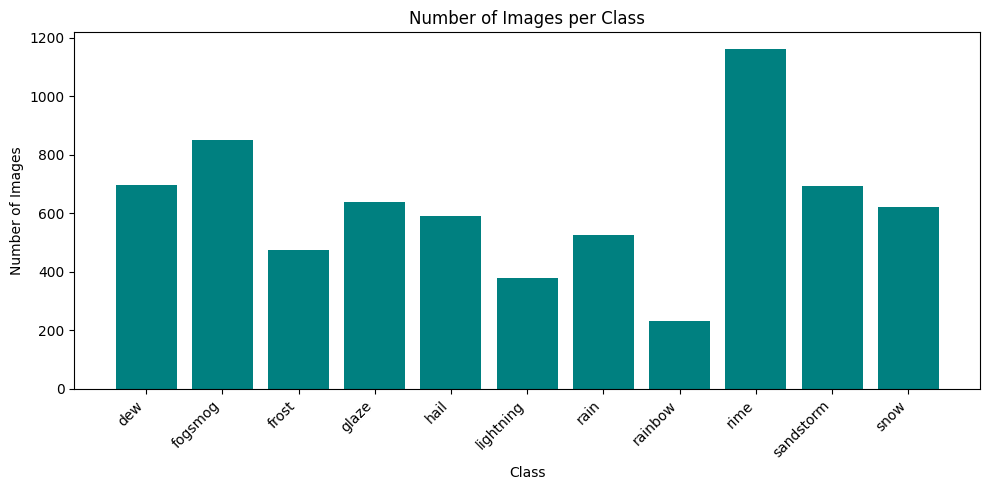
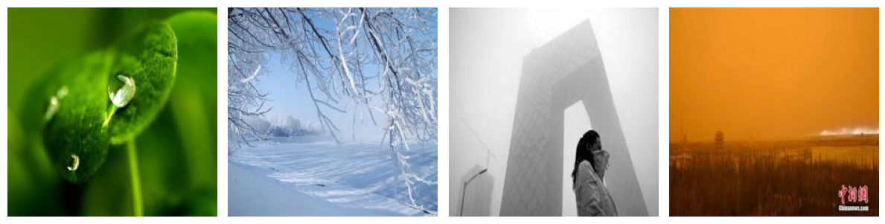
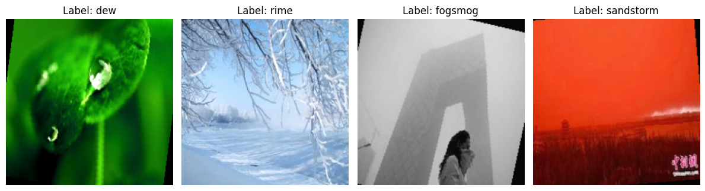
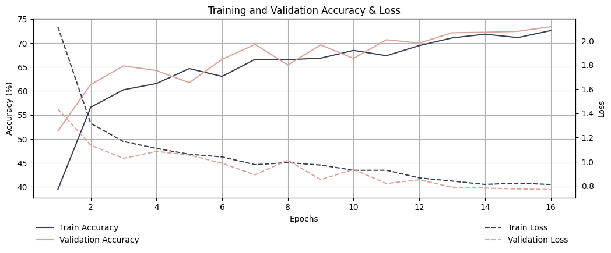
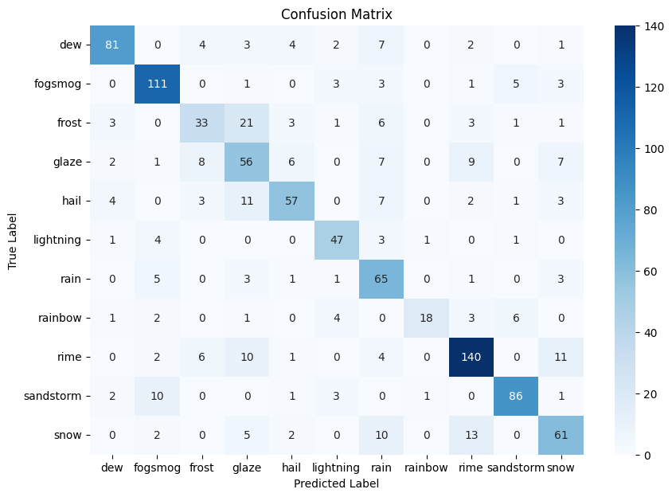
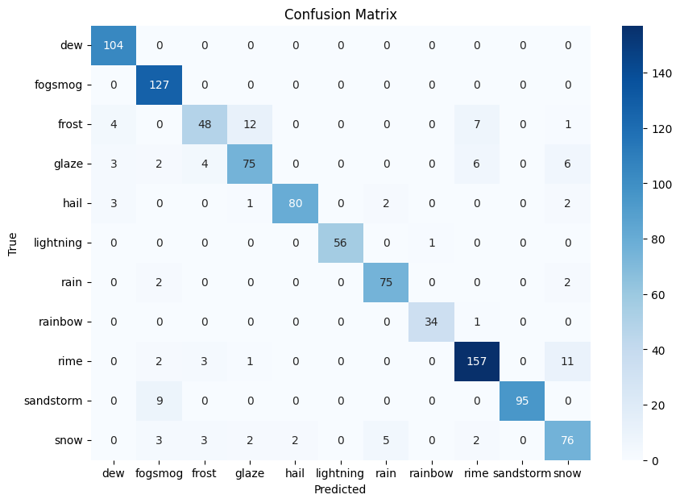
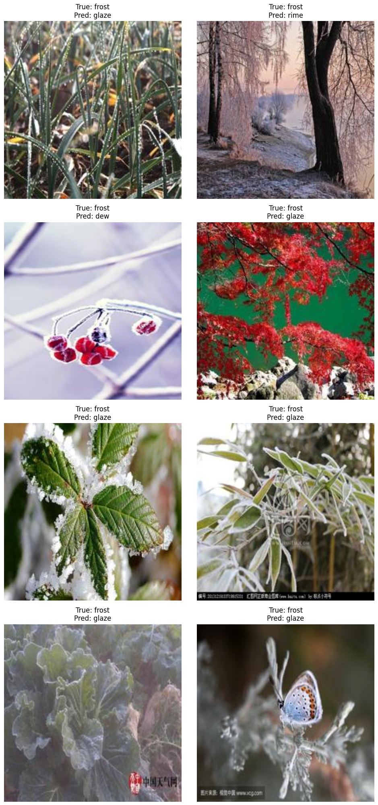

### Weather Classification with CNN and Pretrained ResNet18

This project focuses on classifying weather types from images using Convolutional Neural Networks (CNNs). The model was initially trained using a custom-built CNN, and later, a pretrained ResNet18 architecture was employed to improve performance.

The dataset used in this project is the **Multi-class Weather Dataset** from Kaggle:  
https://www.kaggle.com/datasets/jehanbhathena/weather-dataset

This repository contains the main preprocessing, training, and evaluation steps. For more detailed experiments, plots, and intermediate analysis, see the notebooks included in the project.

## Dataset Overview and Preparation

The dataset contains **6,862 weather images** from **11 classes**: **dew, fogsmog, frost, glaze, hail, lightning, rain, rainbow, rime, sandstorm, and snow**. The classes are slightly imbalanced, with **rime** having the most images and **rainbow** the fewest.



The original image sizes were different, so images were resized to 224 × 224 and converted to RGB when needed. After that, the data was split into **train, validation, and test sets** using a **70/15/15 ratio** with **stratified sampling**, so the class distribution stayed similar in each subset. The final split contains **4,803 training**, **1,029 validation**, and **1,030 test images**.

## Data Transformation and Baseline CNN

In this stage, the images were prepared for training in **PyTorch**. The **training set** was augmented with random flips, rotations, crops, and color changes, while the **validation** and **test** sets were only normalized.

### Augmentation example
#### Before augmentation

#### After augmentation


A custom **CNN** was then built as a baseline model. It included **two convolutional layers** with max-pooling and **two fully connected layers** for classification into **11 weather classes**. The model was trained with **Adam** and **CrossEntropyLoss** for **16 epochs**.

### Custom CNN architecture:

```python
class CNN(nn.Module):
    def __init__(self):
        super(CNN, self).__init__()
        # First convolutional layer: 3 input channel (RGB), 32 output channels
        self.conv1 = nn.Conv2d(in_channels=3, out_channels=32, kernel_size=3, stride=1, padding=1) 
        # Second convolutional layer: 32 input channel, 64 output channels
        self.conv2 = nn.Conv2d(in_channels=32, out_channels=64, kernel_size=3, stride=1, padding=1) 
        # Max pooling layer: 2x2 window, stride 2
        self.pool = nn.MaxPool2d(kernel_size=2, stride=2) 
        # Fully connected layers
        self.fc1 = nn.Linear(64 * 56 * 56, 128) 
        
        # len(train_dataset.classes) = 11
        self.fc2 = nn.Linear(128, len(train_dataset.classes))  

    def forward(self, x):
        # conv1 + relu + pooling
        x = F.relu(self.conv1(x))
        x = self.pool(x)

        # conv2 + relu + pooling
        x = F.relu(self.conv2(x))
        x = self.pool(x)

        # Flatten the tensor
        x = x.reshape(x.shape[0], -1)
        
        # Fully connected layers
        x = F.relu(self.fc1(x))
        x = self.fc2(x)
        
        return x
```

To evaluate the model in more detail, **training and validation** curves were plotted:



Aslo a **confusion matrix** was built: 



The best-performing classes included **fogsmog, lightning, rain, rime, and sandstorm**, while **frost** and **rainbow** were among the hardest to classify. A possible reason is that some classes have very clear visual features, whereas others overlap a lot in color, texture, or scene composition. In particular, winter-related classes such as **frost**, **glaze**, **hail**, and **snow** may look quite similar, which can increase confusion between them. Final validation metrics were:

- **Accuracy:** 0.7337  
- **Precision:** 0.7394  
- **Recall:** 0.7083  
- **F1-score:** 0.7151  

## Transfer Learning with ResNet18

To improve the baseline CNN, a pretrained **ResNet18** model was used. Its final classification layer was replaced with a new fully connected layer for **11 weather classes**, with **dropout** added for regularization. 

This approach gave a clear improvement over the custom CNN. After **5 epochs**, the model reached about **90% validation accuracy**, with strong overall precision, recall, and F1-score.



The confusion matrix and misclassified examples showed that the main errors  concentrated in visually similar **winter-related classes**, such as **frost, glaze, snow, and rime**. 

as We see from the example - they are difficult to distinguish even for a human.



A potential solution to the problem - we can combine them into one winter class, or remove one of them to reduce confusion.

## Additional CNN Experiments

In the last notebook, I tested several extra CNN settings and architecture changes to see whether the custom model could be improved. The best modified version reached around **75% validation accuracy** during training, but on the **test set** it achieved about **71% accuracy**, which was still below the original baseline CNN with **73%**.

These experiments showed that small architecture and parameter changes did not lead to a stable improvement over the baseline model. More information can be seen directly in the `best-model.ipynb` notebook. 

## How to Run

The project notebooks can be run using the dependencies listed in `requirements.txt`.
The images are not included in this repository. In my case, they were downloaded from Kaggle and stored in the `data/dataset` folder.
To reproduce the results, please follow the same structure.

Install the required packages with:

```bash
pip install -r requirements.txt
```

Then, you can run the notebooks in the following order:
1. `data-preparation-1.ipynb` - for data loading.
2. `data-preparation-2 + CNN.ipynb` - for augmentation, splitting, training and evaluating the custom CNN.
3. `resnet18.ipynb` - for training and evaluating the pretrained ResNet18 model.
4. `best-model.ipynb` - for testing additional CNN architectures and parameter changes.
